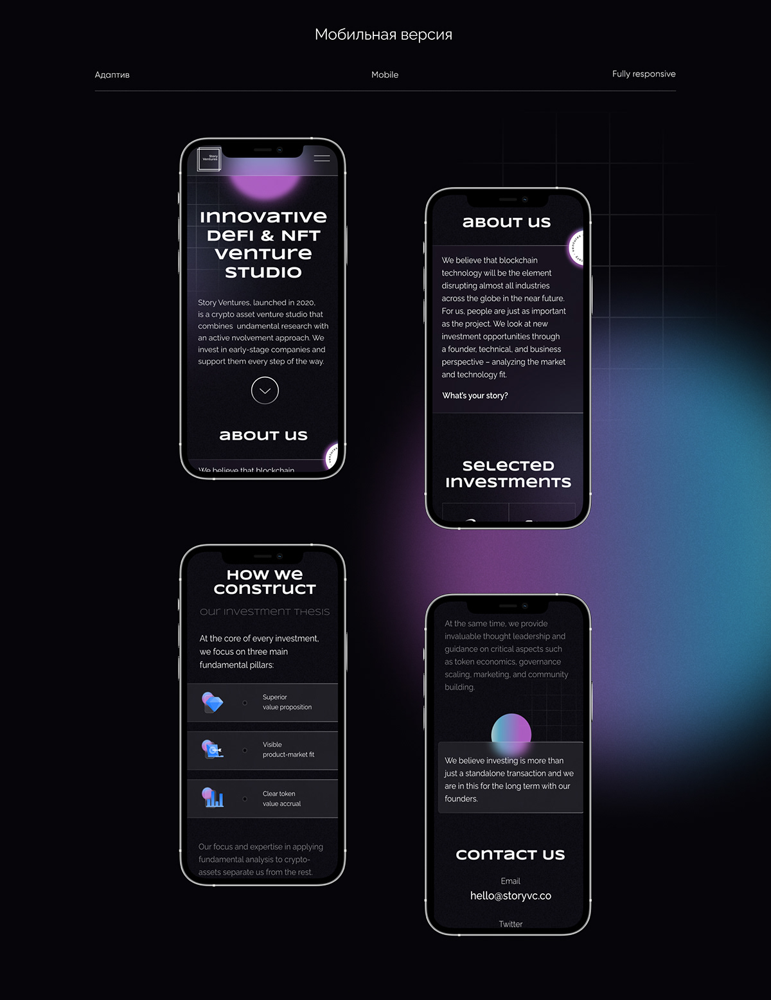

# 💼 Personal Portfolio Website

A clean, modern, and responsive **personal portfolio website** built with **HTML** and **CSS**. This site showcases my journey as a web developer, highlighting my background, skills, and selected projects in an accessible and user-friendly design.

> 🚀 Built as a professional showcase for frontend developer roles

---

## 🔗 Live Demo

👉 **[View Live Portfolio](https://mustafa-sarwari.github.io/Portfolio/)**

---

## 🛠️ Built With


- **HTML5** – Semantic structure and accessibility
- **CSS3** – Modern styling with custom fonts and responsive layout
- **Google Fonts** – Playfair Display and Source Sans Pro
- **Normalize.css** – Cross-browser consistency

---

## 🎯 Features

- ✨ **Clean, modern design** with professional styling
- 📱 **Fully responsive** layout for mobile, tablet, and desktop
- 🎨 **Custom color palette** for visual appeal
- 🔗 **Smooth navigation** with anchor links to sections
- 📸 **Project showcase** with images and descriptions
- 🌐 **Social media integration** (LinkedIn, Instagram, GitHub)
- ♿ **Accessible design** following web standards
- 🚀 **Fast loading** with optimized assets

---

## 📂 Project Structure

```
Portfolio/
├── images/              # Project screenshots and profile image
│   ├── mustafa-sarwari.jpeg
│   ├── resume_site.png
│   ├── portfolio.jpg
│   └── Qiz_app.png
├── index.html          # Main HTML file
├── style.css           # Stylesheet
├── README.md           # Project documentation
├── LICENSE             # MIT License
├── CODE_OF_CONDUCT.md  # Contributor guidelines
├── CONTRIBUTING.md     # Contribution guidelines
├── SECURITY.md         # Security policy
└── package.json        # Project metadata
```

---

## 🚀 Installation & Usage

### Quick Start

1. **Clone the repository**
   ```bash
   git clone https://github.com/mustafa-sarwari/Portfolio.git
   ```

2. **Navigate to the directory**
   ```bash
   cd Portfolio
   ```

3. **Open in browser**
   ```bash
   # Simply open the index.html file in your preferred browser
   # Or use a live server extension in VS Code
   open index.html
   ```

### Development

No build process required! This is a static website - just edit the HTML and CSS files and refresh your browser.

For a better development experience, use a local server:
- **VS Code**: Install the "Live Server" extension
- **Python**: Run `python -m http.server 8000`
- **Node.js**: Use `npx serve`

---

## 📸 Screenshots

### Desktop View


### Featured Projects
The portfolio showcases three main projects:
1. **Responsive Resume Site** - Mobile-friendly resume webpage
2. **Personal Portfolio Website** - This very site!
3. **Interactive Quiz App** - JavaScript quiz with real-time feedback

---

## 🎨 Color Palette

- **Background**: `#eae2b7` (Warm beige)
- **Text**: `#003049` (Deep blue)
- **Links**: `#d62828` (Red)
- **Hover**: `#f77f00` (Orange)

---

## 🤝 Contributing

Contributions, issues, and feature requests are welcome!

See [CONTRIBUTING.md](CONTRIBUTING.md) for ways to get started.

Please adhere to this project's [Code of Conduct](CODE_OF_CONDUCT.md).

---

## 🔒 Security

See [SECURITY.md](SECURITY.md) for security policies and reporting vulnerabilities.

---

## 📄 License

This project is licensed under the **MIT License** - see the [LICENSE](LICENSE) file for details.

---

## 👨‍💻 Author

**Ghulam Mustafa Sarwari**

- 🌐 Portfolio: [mustafa-sarwari.github.io/Portfolio](https://mustafa-sarwari.github.io/Portfolio/)
- 💼 LinkedIn: [@gm-sarwari](https://www.linkedin.com/in/gm-sarwari/)
- 🐙 GitHub: [@mustafa-sarwari](https://github.com/mustafa-sarwari)
- 📸 Instagram: [@gm.sarwari](https://www.instagram.com/gm.sarwari)

---

## 🙏 Acknowledgments

- Design inspiration from modern portfolio trends
- Font families from [Google Fonts](https://fonts.google.com/)
- Icons and graphics from various open-source projects
- Normalize.css for cross-browser consistency

---

<div align="center">

**⭐ Star this repo if you found it helpful!**

Made with ❤️ by Mustafa Sarwari

</div>
